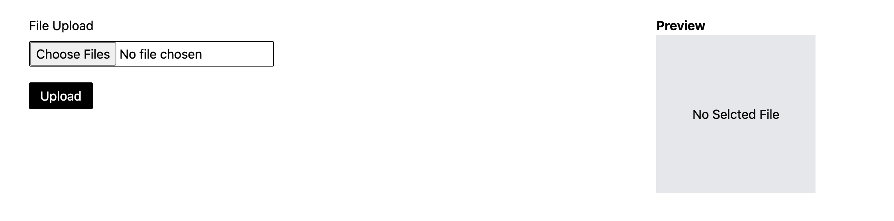
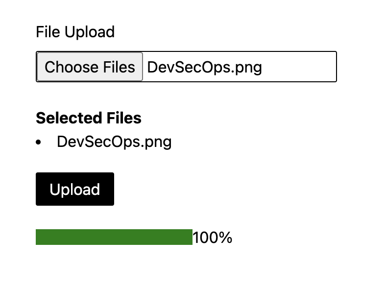
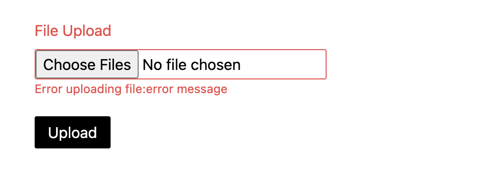

# React-File-Upload

### Component Description

React-File-Upload is a component for uploading photos and videos in a form. It offers preview before uploading and a progress meter during uploading.

#### React File Upload



#### React File Upload with props


#### React File Upload With Success State



#### React File Upload With Error State



#### React File Upload With Preview
- preview by clicking on thumbnail


### Component Usage

To use this component:

```javascript
import FileUpload from './components/FileUpload/FileUpload'
import { borderColorVariants, borderRaduisVariants, colorVariants } from './helpers/enum'

<FileUpload 
  label="File Upload"
  borderColor= {borderColorVariants.BLUE}
  textColor = {colorVariants.BLUE}
  borderRaduis = {borderRaduisVariants.MD}
  />
```

### Component props

- `label` (string) **(Required)**: The text of the label.
- `borderColor` (enum) **(Optional)**: Border color for the input field.
- `textColor` (enum) **(Optional)**: text color for the label.
- `borderRaduis` (enum) **(Optional)**: Border raduis for the input field.
